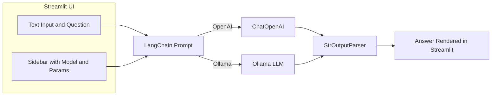
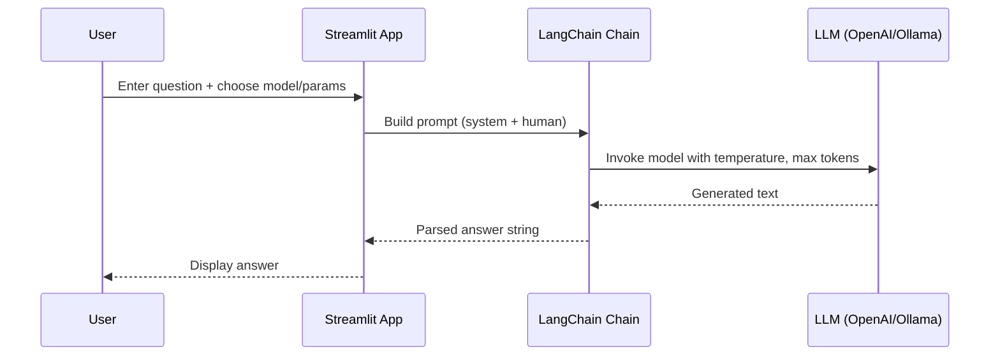

## Enhanced Q&A Chatbot (OpenAI and Ollama)

A lightweight Streamlit app that answers user questions using either OpenAI models or locally hosted Ollama models via LangChain. Includes LangSmith tracing hooks for observability.

### What does this chatbot do?
- **Answer free-form questions**: You type a question, it generates a concise answer.
- **Switchable model backends**:
  - **OpenAI**: `gpt-4o-mini`, `gpt-4-turbo`, `gpt-3.5-turbo` (in `app.py`).
  - **Ollama**: local model such as `gemma:2b` (in `app_ollama.py`).
- **Configurable behavior**: Tune temperature and max tokens from the sidebar.
- **Observability**: LangSmith project and tracing to inspect prompts and model latency.

### How it works (Methods used)
- **Framework**: Streamlit for a minimal, interactive UI.
- **Orchestration**: LangChain `ChatPromptTemplate` → LLM → `StrOutputParser` pipeline.
- **LLMs**:
  - OpenAI via `langchain_openai.ChatOpenAI` (requires API key).
  - Ollama via `langchain_community.llms.Ollama` (requires local Ollama runtime and model pulled).
- **Prompting**: A simple system + human message template: "You are a helpful assistant" and "Question: {question}".
- **Tracing**: LangSmith environment variables enable run logging.

### High-level architecture


### Request flow


### Files
- `app.py`: Streamlit app using OpenAI via LangChain.
- `app_ollama.py`: Streamlit app using local Ollama models via LangChain.
- `.env`: Optional environment variables for keys and LangSmith.

### Quick start
1) Install dependencies
```bash
pip install -r requirements.txt
```

2) (OpenAI route) Set your OpenAI API key
```bash
setx OPENAI_API_KEY "<your_key>"
```
or add to `.env`:
```bash
OPENAI_API_KEY=your_key
```

3) (Optional) Enable LangSmith tracing by setting in `.env`:
```bash
LANGCHAIN_API_KEY=your_langsmith_key
LANGCHAIN_TRACING_V2=true
LANGCHAIN_PROJECT=YourProjectName
```

4a) Run OpenAI app
```bash
streamlit run app.py
```

4b) Run Ollama app (requires Ollama installed and model pulled)
```bash
ollama pull gemma:2b
streamlit run app_ollama.py
```

### Configuration in the UI
- **Model selection**: Choose OpenAI model or Ollama engine.
- **Temperature**: Higher = more creative, lower = more deterministic.
- **Max tokens**: Upper bound for response length.

### Environment variables used
- OpenAI: `OPENAI_API_KEY`
- LangSmith (optional): `LANGCHAIN_API_KEY`, `LANGCHAIN_TRACING_V2`, `LANGCHAIN_PROJECT` (or `LANGCHAIN_PROJECT_OLLAMA` for the Ollama app)

### Notes
- Ensure your network and credentials allow access to OpenAI if using `app.py`.
- For `app_ollama.py`, make sure the local Ollama service is running and the chosen model is available.


